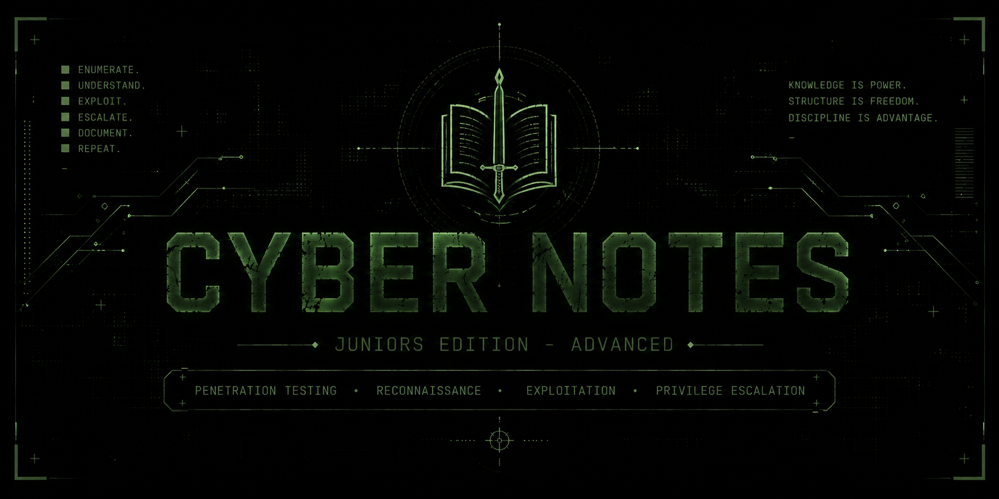

<div align="center">  <br> 

<br><br>

   

<br>

`PENETRATION TESTING` · `RECONNAISSANCE` · `ENUMERATION` · `EXPLOITATION` · `PRIVILEGE ESCALATION`

</div>

---

<table> <tr> <td width="72%" valign="top">

# ABOUT

**Cyber Notes — Juniors Edition: Advanced** is a personal penetration-testing knowledge vault created by **Rodrigo Tripa** to develop practical offensive-security skills beyond the cybersecurity fundamentals established in the previous edition.

This is **Cyber Notes v0.1 — Juniors Edition: Advanced**, built primarily around knowledge acquired through **TryHackMe**, especially the **Jr Penetration Tester** learning path, while also incorporating material from official documentation, books, technical resources, and personal research.

The goal is not to reproduce courses or collect isolated answers. The vault is designed to transform practical penetration-testing training into a structured, reusable knowledge base covering methodologies, techniques, vulnerabilities, tools, and operational concepts.

</td> <td width="28%" align="center" valign="middle">  </td> </tr> </table>

---

# PURPOSE

Cyber Notes — Juniors Edition: Advanced is the second specialised edition of the Cyber Notes collection.

While the **Fundamentals** edition established the general cybersecurity knowledge required to understand computers, networks, operating systems, web technologies, and security principles, this edition moves into the practical discipline of **penetration testing**.

The focus is on understanding how a penetration tester approaches a target: identifying the attack surface, performing reconnaissance, enumerating services, discovering vulnerabilities, exploiting weaknesses, obtaining access, escalating privileges, and performing post-exploitation activities.

The objective is not simply to learn how to operate offensive-security tools. Each technique should be understood in terms of **why it works, what conditions make it possible, and how it fits into a broader penetration-testing methodology**.

---

<div align="center">  </div>

# SECURITY FOCUS

```text
┌──────────────────────────────────────────────────────────────┐
│                                                              │
│  PRIMARY FOCUS        PENETRATION TESTING                    │
│                                                              │
│  CORE                  RECONNAISSANCE · ENUMERATION          │
│                        VULNERABILITY ASSESSMENT              │
│                        EXPLOITATION · PRIVILEGE ESCALATION   │
│                                                              │
│  SPECIALISATIONS       WEB · NETWORK · ACTIVE DIRECTORY      │
│                        CREDENTIALS · POST-EXPLOITATION       │
│                                                              │
│  PHILOSOPHY            ENUMERATE THE TARGET                  │
│                        UNDERSTAND THE WEAKNESS               │
│                        EXPLOIT IT · DOCUMENT IT              │
│                                                              │
└──────────────────────────────────────────────────────────────┘
```

The vault has a deliberate **offensive-security focus**. Defensive concepts may appear when they are necessary to understand an attack, vulnerability, or security mechanism, but the primary objective is developing practical penetration-testing capability.

---

# WHAT'S INSIDE

<table> <tr> <td width="50%" valign="top">

### PENTESTING CORE

`01-Pentesting`

The central methodology of the vault, covering penetration-testing concepts, attack surfaces, reconnaissance, enumeration, vulnerability assessment, exploitation, post-exploitation, and reporting.

`02-Reconnaissance`

Passive and active reconnaissance, OSINT, DNS reconnaissance, subdomain enumeration, technology fingerprinting, and information disclosure.

`03-Network-Pentesting`

Network enumeration, port scanning, service identification, banner grabbing, and common protocols encountered during penetration tests.

`04-Web-Pentesting`

Web enumeration, authentication, authorization, session management, injection vulnerabilities, file-based attacks, SSRF, IDOR, and other web application security concepts.

### EXPLOITATION & ACCESS

`05-Exploitation`

Vulnerability research, CVEs, public exploits, proof-of-concepts, payloads, shells, reverse shells, bind shells, and exploit-development concepts.

`06-Privilege-Escalation`

Techniques and concepts for escalating privileges on Linux and Windows systems.

`07-Credentials`

Password attacks, password cracking, hashes, credential discovery, credential reuse, and authentication attacks.

`08-Active-Directory`

Active Directory from an offensive perspective, including enumeration, LDAP, Kerberos, NTLM, SMB, GPOs, and domain privilege escalation.

</td> <td width="50%" align="center" valign="middle">  </td> </tr> </table>

---

<table> <tr> <td width="50%" align="center" valign="middle">  </td> <td width="50%" valign="top">

# RECONNAISSANCE

Reconnaissance is the first major stage of the penetration-testing workflow.

This section covers the process of gathering information about a target before exploitation, including passive reconnaissance, active reconnaissance, OSINT, DNS analysis, subdomain discovery, technology fingerprinting, and information disclosure.

The objective is to understand the target's attack surface before attempting to exploit it.

---

# NETWORK PENTESTING

Network penetration testing focuses on discovering and analysing exposed services and network infrastructure.

The section covers port scanning, service enumeration, banner grabbing, and protocols commonly encountered during offensive operations such as SMB, FTP, SSH, DNS, TCP, UDP, and HTTP.

The objective is to move from an unknown target to an accurate understanding of its reachable services and potential attack surface.

</td> </tr> </table>

---

<table> <tr> <td width="50%" valign="top">

# WEB PENTESTING

Web applications represent one of the most common attack surfaces encountered during penetration tests.

This section covers web enumeration, authentication and authorization, session management, input validation, injection vulnerabilities, file inclusion, file upload vulnerabilities, SSRF, IDOR, and related application-security concepts.

The focus is on understanding the underlying vulnerability classes rather than memorising isolated payloads.

---

# EXPLOITATION

Exploitation is the process of turning a discovered vulnerability into meaningful access or impact.

This section covers vulnerability research, CVEs, public exploit databases, proof-of-concepts, payloads, shells, reverse shells, bind shells, and introductory exploit-development concepts.

The objective is to understand the relationship between a vulnerability, its exploitation conditions, the payload used, and the resulting execution context.

</td> <td width="50%" align="center" valign="middle"> 

<br><br>

 </td> </tr> </table>

---

# PRIVILEGE ESCALATION

Privilege escalation focuses on moving from limited access to a more privileged security context.

The vault separates Linux and Windows privilege-escalation concepts while maintaining the common principles behind enumeration, misconfiguration discovery, weak permissions, exposed credentials, vulnerable services, scheduled tasks, SUID binaries, sudo configuration, capabilities, and other escalation paths.

Privilege escalation is treated as an extension of enumeration: obtaining a shell is not necessarily the end of the compromise.

---

# CREDENTIALS

Credential attacks cover the discovery, extraction, reuse, and cracking of authentication material.

The section includes password attacks, password cracking, hashes, credential discovery, credential reuse, and authentication attacks.

Understanding how credentials are stored, transmitted, exposed, and attacked is essential because credentials frequently provide a path between otherwise isolated systems and privilege levels.

---

# ACTIVE DIRECTORY

Active Directory represents a specialised area of the Advanced edition.

The section approaches Windows domains from an offensive perspective, covering domain enumeration, users and groups, LDAP, Kerberos, NTLM, SMB, Group Policy, authentication mechanisms, and domain privilege escalation.

The objective is to understand how trust relationships, authentication protocols, permissions, and domain architecture can create attack paths through an enterprise environment.

---

# POST-EXPLOITATION

Post-exploitation covers the activities performed after obtaining initial access to a system.

This includes situational awareness, credential harvesting, lateral movement, persistence concepts, pivoting, and tunneling.

The objective is to understand how a compromised host can provide access to additional information, privileges, systems, or network segments.

---

# TOOLS & PRACTICE

The vault contains dedicated documentation for tools commonly used throughout penetration-testing workflows.

```text
RECON / ENUMERATION       Nmap · Gobuster · ffuf · Nikto
WEB SECURITY              Burp Suite · SQLMap
PASSWORD ATTACKS          Hydra · John the Ripper
EXPLOITATION              Metasploit · Meterpreter · Msfvenom
NETWORKING                Netcat
PRIVILEGE ESCALATION      LinPEAS · WinPEAS · GTFOBins · Living off the Land
POST-EXPLOITATION         Mimikatz · BloodHound · Empire
```

Practice environments and labs:

```text
TRYHACKME                 Structured learning path (Jr Pentester)
HACKTHEBOX                Realistic penetration-testing scenarios
PROVING GROUNDS           Intermediate to advanced challenges
VULNHUB                   Community-driven vulnerable machines
```

---

<div align="center">  </div>

# THE PENTESTING WORKFLOW

The penetration-testing process is fundamentally iterative. The following represents a typical workflow:

```text
RECONNAISSANCE
      │
      ▼
ATTACK SURFACE DISCOVERY
      │
      ▼
ENUMERATION
      │
      ▼
VULNERABILITY ASSESSMENT
      │
      ▼
EXPLOITATION
      │
      ▼
INITIAL ACCESS
      │
      ▼
PRIVILEGE ESCALATION
      │
      ▼
POST-EXPLOITATION
      │
      ▼
LATERAL MOVEMENT / PIVOTING
      │
      ▼
DOCUMENTATION & REPORTING
```

This workflow is not strictly linear. Real penetration tests are iterative.

Information discovered during enumeration may change the reconnaissance strategy. Exploitation may reveal new services. Privilege escalation may expose credentials that lead to another host. Post-exploitation may reveal an entirely new attack surface.

The methodology therefore operates as a continuous cycle of **discovery, analysis, exploitation, and reassessment**.

---

# TRYHACKME FOUNDATION

### JR PENETRATION TESTER

`PRIMARY LEARNING PATH`

The **Jr Penetration Tester** path provides the primary practical curriculum for this edition.

Its concepts are progressively integrated into the permanent knowledge base rather than remaining exclusively as platform-specific material.

Learning progress and room summaries are maintained under:

`13-Learning/TryHackMe`

### ADDITIONAL ROOMS

`SUPPLEMENTARY PRACTICE`

Additional TryHackMe rooms may be incorporated when they introduce useful techniques, vulnerabilities, tools, or concepts that strengthen the penetration-testing knowledge base.

Room-specific practical material is maintained separately under:

`11-Walkthroughs`

> The vault is an educational resource and is not affiliated with or endorsed by TryHackMe.

---

# RELATIONSHIP WITH FUNDAMENTALS

This edition is part of the same **Cyber Notes** collection as:

**Cyber Notes — Juniors Edition: Fundamentals**

The two repositories are intentionally independent.

The Fundamentals edition focuses on establishing the technical foundation required to understand cybersecurity. The Advanced edition assumes that foundation and applies it to penetration testing.

Some concepts therefore appear in both repositories.

This is intentional.

Networking, Linux, Windows, HTTP, DNS, authentication, and Active Directory may be studied again from an offensive perspective because understanding a technology and understanding **how to attack it** are different layers of knowledge.

```text
CYBER NOTES
│
├── JUNIORS EDITION
│   │
│   ├── FUNDAMENTALS
│   │   └── v1.0
│   │
│   └── ADVANCED
│       └── v0.1
│            │
│            ├── RECONNAISSANCE
│            ├── ENUMERATION
│            ├── EXPLOITATION
│            ├── PRIVILEGE ESCALATION
│            ├── ACTIVE DIRECTORY
│            └── POST-EXPLOITATION
│
└── FUTURE EDITIONS
```

The goal is progression, not artificial separation.

---

# OBSIDIAN VAULT

Cyber Notes was designed primarily to be **used and viewed as an Obsidian vault**.

The internal structure uses Markdown, folders, tags, metadata, and Obsidian wikilinks to connect penetration-testing concepts across different domains.

The repository therefore represents more than conventional documentation. It is the source structure of a personal technical knowledge system designed to evolve alongside practical experience.

For the best experience, clone the repository and open the project directory as an **Obsidian vault**.

---

# VERSION 0.1

Cyber Notes — Juniors Edition: Advanced **v0.1** represents the initial construction of this specialised repository.

The structure has been established, but the knowledge base is still being built through the Jr Penetration Tester learning path, additional TryHackMe rooms, technical research, and practical experimentation.

Version `1.0` will represent the completion of the initial Advanced curriculum and the integration of its core penetration-testing knowledge.

Future versions will continue expanding and refining the repository as new techniques, vulnerabilities, technologies, tools, and practical experience are acquired.

```text
CYBER NOTES
│
└── JUNIORS EDITION
    │
    ├── FUNDAMENTALS
    │   └── v1.0
    │
    └── ADVANCED
        └── v0.1
             │
             ├── PENETRATION TESTING
             ├── RECONNAISSANCE
             ├── NETWORK PENTESTING
             ├── WEB PENTESTING
             ├── EXPLOITATION
             ├── PRIVILEGE ESCALATION
             ├── CREDENTIALS
             ├── ACTIVE DIRECTORY
             └── POST-EXPLOITATION
```

---

# ROADMAP

```text
[✓] Create the Advanced repository
[✓] Establish the penetration-testing knowledge structure
[ ] Complete the Jr Penetration Tester learning path
[ ] Build reconnaissance knowledge
[ ] Build enumeration knowledge
[ ] Build network penetration-testing knowledge
[ ] Build web penetration-testing knowledge
[ ] Build exploitation knowledge
[ ] Build Linux privilege-escalation knowledge
[ ] Build Windows privilege-escalation knowledge
[ ] Build credential-attack knowledge
[ ] Build Active Directory knowledge
[ ] Build post-exploitation knowledge
[ ] Document the core penetration-testing tools
[ ] Build practical cheatsheets
[ ] Integrate additional relevant TryHackMe rooms
[ ] Review and consolidate the knowledge base
[ ] Release Cyber Notes — Juniors Edition: Advanced v1.0
```

Cyber Notes is intentionally maintained as a living knowledge base. Existing notes may be rewritten, expanded, reorganised, or replaced as technical understanding improves.

---

# AUTHOR

<div align="center">


<br>

`RODRIGO TRIPA`

**CYBERSECURITY · OFFENSIVE SECURITY · LINUX**

<br>

*Understand systems. Study security. Keep building.*

</div>

---

# LICENSE

This project is distributed under the **MIT License**.

See [`LICENSE`](./LICENSE) for the full license text.

---

# DISCLAIMER

Cyber Notes is an educational knowledge base created for legitimate cybersecurity learning, research and experimentation.

Security techniques and tools documented here should only be used against systems and environments where you have explicit authorization.

Technical information may become outdated or contain mistakes. Important details should always be verified against current official documentation and other authoritative sources.

---

<div align="center">


<br>

`CYBER NOTES v1.0`

`JUNIORS EDITION · FUNDAMENTALS`

<br>

**Created by Rodrigo Tripa**

</div>
